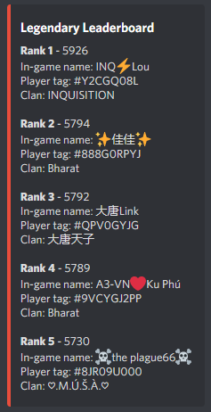

# Discord Coc Leaderboard Feed
A simple and (soon to be) easily customizable script
to create live Clash Of Clans leaderboards
and send them via a webhook into your Discord server.

## Table of Contents
* [General Info](#general-information)
* [Features](#features)
* [Example Screenshot](#example-screenshot)
* [Setup](#setup)
* [Future Plans](#future-plans)

## General Information
There already are some decent discord bots with a similar
leaderboard feed like Scatterbot or Teamutils.
However, if you want to customize its behaviour or only need
the  feed and not all the other features of those bots,
this little script might come in handy. You need to self-host
it, but you have the total control of how it behaves.

## Features
This script provides the following features:
- daily leaderboard feed at a given time
- leaderboard feed at every end of season (planned)
- leaderboards including all players in your clan[family]
- leaderboards including a custom list of players (planned)
- global/local leaderboards (planned)
- custom formatting (planned)
- home base leaderboards as well as builder base ones (planned)

## Example Screenshot

## Setup
You will need to host this script yourself. Recommendations
where and how to do that can be found here:
https://github.com/wpmjones/apibot/blob/master/Rules/vps_services.md
(credits to the admin team of the Clash API developers discord server)

Next, I recommend using a virtual environment to run the script.
Here is a little tutorial how to set up a venv: https://pythonbasics.org/virtualenv/

When you have the venv, install the required libraries using
`pip install -r requirements.txt`

You will need a clash of clans developer account, so the script
can get data from the coc api. Create that account at
https://developer.clashofclans.com/#/
and paste your credentials into [credentials.py](credentials.py)

Now create a webhook in your discord server and paste its link also into
[credentials.py](credentials.py)

Finally, customize your settings in [settings.py](settings.py)
and run the script.

## Future Plans
- implement all the planned features in [Features](#features)
